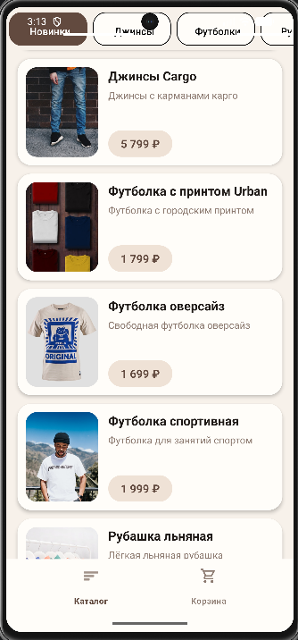
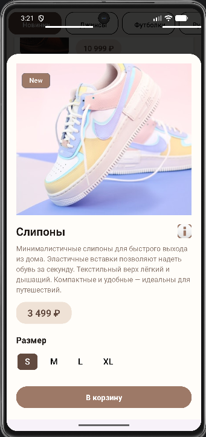
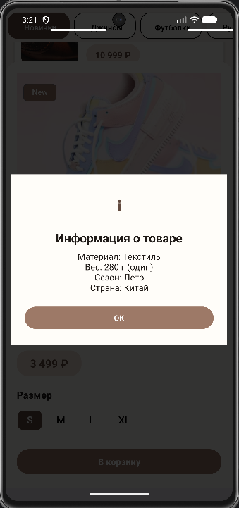
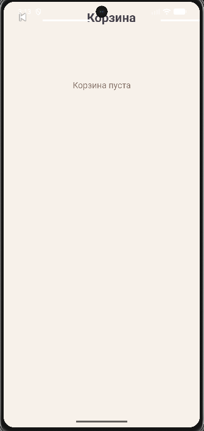
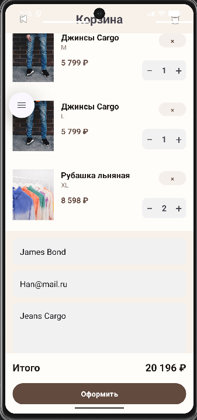

# team-kapibarchiki
Студенческий проект: team-kapibarchiki

## О платформе
Категория | Технология 
----------|------------
Платформа | Android 
Язык | Kotlin 
UI | Jetpack Compose 
Сборка | Gradle 

## Описание
CistYana - мобильное приложение, созданное для Android. Приложение способно показывать каталог товаров, их карточки. Все товары представлены по категориям.

## Возможности

- просмотр каталога товаров;
- фильтрация по категориям;
- раздел «Новинки»;
- просмотр подробной информации о товаре;
- выбор размера;
- добавление товара в корзину;
- изменение количества товаров;
- удаление и очистка корзины;
- оформление заказа;
- offline-режим с использованием локального кэша;
- сохранение положение прокрутки при переключении категорий

## Скриншоты

### Каталог


### Карточка товара



### Корзина



## Архитектура

```text
Activity
   ↓
ViewModel
   ↓
Repository
   ↓
API / Local SQLite Cache
```
## Сборка проекта

1. Клонировать репозиторий:

```bash
git clone <https://github.com/FEIP-FEFU-Mobile-Spring-2026/team-kapibarchiki.git>
```
2. Открыть проект в Android Studio.
3. Дождаться завершения синхронизации Gradle.
4. Выполнить сборку проекта

Через Android Studio:
```text
Build → Assemble
```
или через терминал:
```bash
./gradlew assembleDebug
```
### Запуск
1. Запустить Android-эмулятор или подключить физическое устройство.

2. Нажать кнопку **Run** в Android Studio.

3. Выбрать устройство для запуска приложения.

## Соcтав Команды
ФИО | Роль 
------|------
Андерст Эдуард | BackEnd
Елеков Владислав | Disgner, FrontEnd

